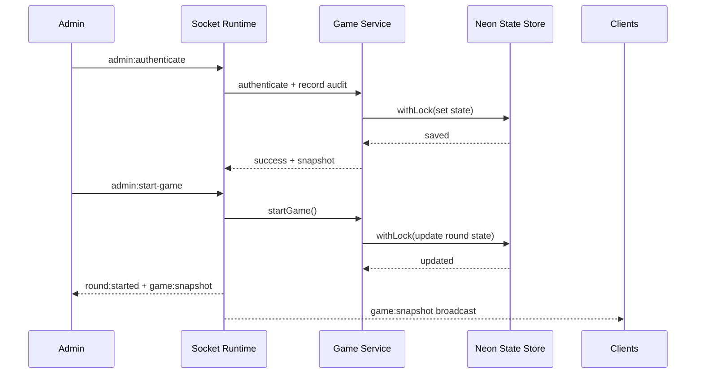

# INVEST-NEUTRON-3

Real-time auction game platform with a Socket.io backend and a React frontend.

## At A Glance

| Area | Stack | Purpose |
| --- | --- | --- |
| Backend | Node.js, Express, Socket.io, Drizzle, Neon Postgres | Realtime game state, admin actions, scoring, audit trail |
| Frontend | React, TypeScript, Vite | Admin + player UI, live snapshots, round updates |
| Testing | Vitest | Unit/integration checks for engine, server, scoring, UI |

## System Diagram

```mermaid
flowchart LR
  A[Browser Clients\nAdmin + Teams] <-->|Socket.io events| B[Backend Service\nExpress + Socket Runtime]
  B --> C[Game Service\nState + Rules + Scoring]
  C --> D[NeonStateStore\nDrizzle ORM]
  D --> E[(Neon Postgres\ngame_state table)]
  B --> F[/health and /state]
```

## Runtime Flow



## Repository Layout

```text
.
|- backend-main/
|  |- app/                 # New backend implementation (Neon + services)
|  |- src/                 # Runtime entry + core engine modules
|  |- tests/               # Backend Vitest suites
|  |- dev-testing/         # Socket test scripts
|- frontend/
|  |- src/                 # React app, socket client, types, tests
|- TESTING_GUIDE.md
```

## Quick Start

### 1) Backend

```bash
cd backend-main
npm install
npm run db:push
npm run dev
```

### 2) Frontend

```bash
cd frontend
npm install
npm run dev
```

## Environment (Backend)

| Variable | Required | Example |
| --- | --- | --- |
| `PORT` | No | `3000` |
| `ADMIN_SECRET` | Yes | `replace-me` |
| `CORS_ORIGINS` | Yes (prod) | `http://localhost:5173` |
| `DATABASE_URL` | Yes (prod) | `postgresql://...` |
| `ALLOW_IN_MEMORY_STORE` | Dev fallback | `true` |
| `ROUND_DURATION_MS` | No | `600000` |
| `TOTAL_ROUNDS` | No | `3` |

## Core Socket Events

| Direction | Event | Purpose |
| --- | --- | --- |
| Client -> Server | `admin:authenticate` | Admin login |
| Client -> Server | `admin:start-game` | Start round 1 |
| Client -> Server | `admin:next-round` | Advance round |
| Client -> Server | `admin:end-round` | Force end active round |
| Client -> Server | `admin:get-audit-log` | Fetch persisted admin history |
| Server -> Client | `game:snapshot` | Current sanitized game state |
| Server -> Client | `round:started` | Round start payload |

## Test Commands

```bash
# backend
cd backend-main && npm test

# frontend
cd frontend && npm test

# frontend typecheck
cd frontend && npx tsc --noEmit
```

## Deployment Notes

- Use `DATABASE_URL` in production (Neon).
- Run `npm run db:push` during deploy/migration stage.
- Keep `ALLOW_IN_MEMORY_STORE=false` in production.
- Ensure WebSocket upgrades are enabled on proxy/platform.
